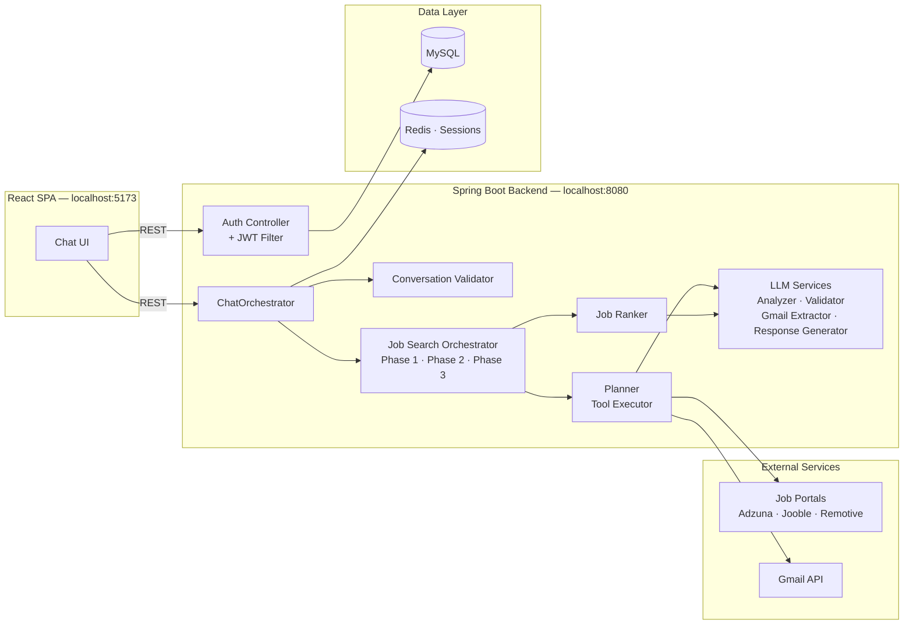
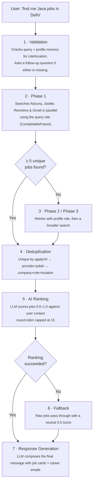

<div align="center">


<h1>JobLelo</h1>

<p><b>One search. Every source. One place.</b></p>
<p>JobLelo searches every job portal you care about — and your inbox — at the same time, then uses AI to tell you which results are actually worth your time.</p>

<a href="#quick-start"><b>Quick Start</b></a> ·
<a href="#architecture"><b>Architecture</b></a> ·
<a href="#api-reference"><b>API Reference</b></a> ·
<a href="#troubleshooting"><b>Troubleshooting</b></a>

</div>

---

## Why JobLelo?

Job hunting today means keeping a dozen tabs open — Naukri, LinkedIn, Indeed, your inbox — and manually cross-checking which listings are relevant. JobLelo collapses that into a single conversation:

- **Ask in plain English** — "find me remote React jobs in Bangalore" — no filters or forms.
- **Search happens in parallel** across Adzuna, Jooble, and Remotive, so you're not waiting on one slow API.
- **Gmail is read alongside job boards**, so interview invites, offers, and rejections surface next to fresh listings.
- **An LLM ranks every result** against your profile instead of dumping a raw, unsorted list on you.

---

## Table of Contents

- [Features](#features)
- [Tech Stack](#tech-stack)
- [Architecture](#architecture)
- [Search Pipeline](#search-pipeline)
- [Prerequisites](#prerequisites)
- [Quick Start](#quick-start)
- [Verifying It Works](#verifying-it-works)
- [Environment Variables Reference](#environment-variables-reference)
- [API Reference](#api-reference)
- [Project Structure](#project-structure)
- [How It Works](#how-it-works)
- [Troubleshooting](#troubleshooting)
- [Contributing](#contributing)
- [License](#license)

---

## Features

| Feature | Description |
|---|---|
| 🔎 **Multi-source search** | Aggregates jobs from Adzuna, Jooble, and Remotive in a single parallel query |
| 📧 **Gmail integration** | Scans your inbox for job-related emails — recruiter messages, applications, interviews, offers, rejections |
| 🧠 **AI ranking** | Groq (`llama-3.3-70b`) scores each job against your profile with a relevance percentage and a written reason. Gemini 2.5 Flash handles conversational responses |
| 🏷️ **Career email detection** | Automatically categorizes emails by type (Interview, Offer, Rejection, Assessment, etc.) with priority flags |
| 🔁 **Smart fallbacks** | Handles rate limits with automatic retries, secondary API keys, and a raw-job fallback when LLM ranking fails |
| 🔐 **OAuth authentication** | Sign in with Google or GitHub; JWT sessions with automatic refresh-token rotation |
| 🧾 **Profile memory** | Learns your preferred role, skills, location, and experience from past conversations |
| 💬 **Conversational UI** | Natural-language job search with follow-up questions and suggestion chips |
| 🌗 **Dark mode** | Full CSS custom-property theming — light and dark themes out of the box |

---

## Tech Stack

### Backend

| Category | Technology | Version |
|---|---|---|
| Language | Java | 21 |
| Framework | Spring Boot | 3.5.14 |
| Security | Spring Security + JWT (HMAC-SHA512) | 6.5 |
| Database | MySQL + Spring Data JPA | 8.0 |
| Cache | Redis + Spring Data Redis | 7.x |
| LLM SDK | LangChain4j | 1.16.1 |
| LLM Providers | Gemini 2.5 Flash (response generation) · Groq `llama-3.3-70b` (ranking, extraction, validation) | — |
| Build | Maven | — |

### Frontend

| Category | Technology | Version |
|---|---|---|
| Framework | React | 19 |
| Routing | React Router | 7 |
| Styling | Tailwind CSS | 4 |
| Build | Vite | 6 |
| HTTP | Fetch API with auto-refresh interceptor | — |

---

## Architecture



---

## Search Pipeline



---

## Prerequisites

| Tool | Version | Check Command | Purpose |
|---|---|---|---|
| **Java** | 21+ | `java -version` | Runs the backend |
| **Maven** | 3.8+ | `mvn -version` | Builds the backend |
| **Node.js** | 20+ | `node -v` | Runs the frontend |
| **MySQL** | 8.0+ | `mysql --version` | Primary database |
| **Redis** | 7+ | `redis-cli ping` | Session cache |

You'll also need API keys from these services (all have free tiers):

| Service | Why You Need It | Free Tier |
|---|---|---|
| [Groq](https://console.groq.com) | LLM inference for ranking, extraction, validation | 100K TPD free |
| [Google Cloud](https://console.cloud.google.com) | OAuth login + Gmail API | Free OAuth, Gmail API free |
| [GitHub](https://github.com/settings/developers) | OAuth login | Free |
| [Adzuna](https://developer.adzuna.com) | Job search API | 1,000 API calls/month free |
| [Jooble](https://jooble.org/api) | Job search API | 100 API calls/day free |

---

## Quick Start

### 1. Database & Redis

**MySQL** — create the database:

```sql
CREATE DATABASE joblelo_db CHARACTER SET utf8mb4 COLLATE utf8mb4_unicode_ci;
```

**Redis** — start the server (default port `6379`):

| OS | Command |
|---|---|
| macOS | `brew services start redis` |
| Linux | `sudo systemctl start redis` |
| Windows | Use WSL, or the Redis MSI installer |

### 2. Register OAuth Apps

<details>
<summary><b>Google OAuth</b></summary>

1. Open [Google Cloud Console](https://console.cloud.google.com)
2. Create a new project (or select an existing one)
3. Go to **APIs & Services → Credentials**
4. Click **Create Credentials → OAuth Client ID**
5. Application type: **Web application**, Name: `JobLelo`
6. **Authorized JavaScript origins:** `http://localhost:5173`
7. **Authorized redirect URIs:** `http://localhost:8080/public/oauth/callback`
8. Click **Create** and copy the **Client ID** and **Client Secret**

</details>

<details>
<summary><b>GitHub OAuth</b></summary>

1. Open [GitHub Developer Settings](https://github.com/settings/developers)
2. Click **OAuth Apps → New OAuth App**
3. Application name: `JobLelo`
4. Homepage URL: `http://localhost:5173`
5. Authorization callback URL: `http://localhost:8080/public/oauth/github/callback`
6. Click **Register application**, then **Generate a new client secret**
7. Copy the **Client ID** and **Client Secret**

</details>

### 3. Get API Keys

| Service | Steps |
|---|---|
| **Groq** | Sign up at [console.groq.com](https://console.groq.com) → **API Keys** → create a key. Optionally create a second key under a different org for fallback |
| **Adzuna** | Sign up at [developer.adzuna.com](https://developer.adzuna.com) → copy your **App ID** and **App Key** |
| **Jooble** | Sign up at [jooble.org/api](https://jooble.org/api) → copy your **API Key** |

### 4. Backend Setup

```bash
cd backend
cp .env.example .env
```

Edit `backend/.env` with your actual keys:

```env
# ── OAuth ──────────────────────────────────────────────
GOOGLE_CLIENT_ID=your-google-client-id
GOOGLE_CLIENT_SECRET=your-google-client-secret
GITHUB_CLIENT_ID=your-github-client-id
GITHUB_CLIENT_SECRET=your-github-client-secret

# ── JWT (generate via: openssl rand -base64 64) ───────
SECRET_KEY=your-generated-secret-key

# ── Gmail ──────────────────────────────────────────────
GMAIL_REDIRECT_URI=http://localhost:5173/gmail/callback
GMAIL_ENCRYPTION_KEY=your-generated-32-byte-key

# ── Database ───────────────────────────────────────────
DB_URL=jdbc:mysql://localhost:3306/joblelo_db
DB_USERNAME=root
DB_PASSWORD=your-mysql-password

# ── LLM ────────────────────────────────────────────────
GROQ_API_KEY=gsk_your-groq-api-key
GROQ_FALLBACK_API_KEY=gsk_your-fallback-groq-key
OPEN_ROUTER_API_KEY=sk-or-your-openrouter-key
GEMINI_API_KEY=your-gemini-api-key

# ── Job Portals ────────────────────────────────────────
ADZUNA_APP_ID=your-adzuna-app-id
ADZUNA_APP_KEY=your-adzuna-app-key
JOOBLE_API_KEY=your-jooble-api-key

# ── Config ─────────────────────────────────────────────
FRONTEND_URL=http://localhost:5173
COOKIE_SECURE=false
REDIS_URL=redis://127.0.0.1:6379/0
```

> ⚠️ **Never commit your `.env` file.** The values above (including the sample keys) are placeholders — generate your own secrets, don't reuse examples from documentation.

**Generate `SECRET_KEY`:**

```bash
# macOS / Linux
openssl rand -base64 64

# Windows (PowerShell)
[System.Convert]::ToBase64String([System.Security.Cryptography.RandomNumberGenerator]::GetBytes(64))
```

**Generate `GMAIL_ENCRYPTION_KEY`:**

```bash
# macOS / Linux
openssl rand -base64 32

# Windows (PowerShell)
[System.Convert]::ToBase64String([System.Security.Cryptography.RandomNumberGenerator]::GetBytes(32))
```

**Start the backend:**

```bash
./mvnw spring-boot:run
```

Expect to see:

```
Started JobAgentBackendApplication in 26 seconds
Tomcat started on port 8080
```

> ℹ️ First startup takes longer — Hibernate creates database tables and Maven resolves dependencies.

### 5. Frontend Setup

Open a **second terminal**:

```bash
cd frontend
cp .env.example .env
# Default VITE_API_URL=http://localhost:8080 is correct for local dev

npm install
npm run dev
```

The app opens at **http://localhost:5173**.

---

## Verifying It Works

1. Open **http://localhost:5173**
2. Click **Continue with Google** or **Continue with GitHub**
3. Complete the OAuth flow in your browser
4. You'll land on the chat interface
5. Try a search: `"find me Java developer jobs in Delhi"` or `"remote React jobs"`
6. JobLelo searches portals (and your inbox, if Gmail is connected), ranks the results, and displays them

**Optional — connect Gmail:** click the **＋** icon in the chat input → **Connect** on Gmail → grant read-only email access. This enables scanning recruiter emails, interview invites, and application-status updates from your inbox.

---

## Environment Variables Reference

### Backend (`backend/.env`)

| Variable | Required | Default | Description |
|---|:---:|---|---|
| `GOOGLE_CLIENT_ID` | ✅ | — | Google OAuth client ID |
| `GOOGLE_CLIENT_SECRET` | ✅ | — | Google OAuth client secret |
| `GITHUB_CLIENT_ID` | ✅ | — | GitHub OAuth client ID |
| `GITHUB_CLIENT_SECRET` | ✅ | — | GitHub OAuth client secret |
| `SECRET_KEY` | ✅ | — | HMAC-SHA512 key for JWT signing (base64) |
| `GMAIL_REDIRECT_URI` | ✅ | — | Gmail OAuth redirect (must match Google Cloud Console) |
| `GMAIL_ENCRYPTION_KEY` | ✅ | — | AES-256 key for encrypting stored Gmail tokens (base64, 32 bytes) |
| `DB_URL` | ✅ | — | MySQL JDBC URL |
| `DB_USERNAME` | ✅ | — | MySQL user |
| `DB_PASSWORD` | ✅ | — | MySQL password |
| `GROQ_API_KEY` | ✅ | — | Primary Groq API key |
| `GROQ_FALLBACK_API_KEY` | ⬜ | — | Secondary Groq key for rate-limit fallback |
| `OPEN_ROUTER_API_KEY` | ⬜ | — | OpenRouter key (alternative LLM provider) |
| `GEMINI_API_KEY` | ✅ | — | Google Gemini API key (response generation) |
| `ADZUNA_APP_ID` | ✅ | — | Adzuna application ID |
| `ADZUNA_APP_KEY` | ✅ | — | Adzuna application key |
| `JOOBLE_API_KEY` | ✅ | — | Jooble API key |
| `FRONTEND_URL` | ✅ | `http://localhost:3000` | Frontend URL for OAuth redirects |
| `COOKIE_SECURE` | ⬜ | `false` | Set `true` in production for HTTPS cookies |
| `REDIS_URL` | ✅ | — | Redis connection URL |

### Frontend (`frontend/.env`)

| Variable | Required | Default | Description |
|---|:---:|---|---|
| `VITE_API_URL` | ✅ | `http://localhost:8080` | Backend API base URL |

---

## API Reference

### Auth

| Method | Endpoint | Description |
|---|---|---|
| `GET` | `/public/google/login` | Redirects to Google consent screen |
| `GET` | `/public/oauth/callback?code=...` | Google OAuth callback |
| `GET` | `/public/github/login` | Redirects to GitHub consent screen |
| `GET` | `/public/oauth/github/callback?code=...` | GitHub OAuth callback |
| `POST` | `/public/refreshtoken` | Exchanges refresh cookie for a new access token |
| `GET` | `/api/v1/user` | Returns the current user profile (requires Bearer token) |

### Chat

| Method | Endpoint | Description |
|---|---|---|
| `POST` | `/api/v1/agent/create-session` | Creates a new chat session, returns `sessionId` |
| `POST` | `/api/v1/agent/chat` | Sends a message, returns the AI response with jobs and career emails |

**Request**

```json
{
  "sessionId": "uuid-session-id",
  "message": "find me Java developer jobs in Delhi"
}
```

**Response**

```json
{
  "content": "I found 5 jobs matching your profile. Here are the top matches...",
  "role": "assistant",
  "type": "SEARCH_JOB",
  "jobs": [
    {
      "role": "Senior Java Developer",
      "company": "Example Corp",
      "location": "New Delhi",
      "provider": "ADZUNA",
      "relevanceScore": 0.92,
      "applyUrl": "https://example.com/apply",
      "recommendationReason": "Strong match: Java 11, Spring Boot, Microservices - aligns with your 2 years of experience",
      "salary": "₹12,00,000 - ₹18,00,000",
      "employmentType": "Full-time",
      "workplaceType": "On-site",
      "companyLogo": "https://logo.example.com/logo.png"
    }
  ],
  "careerEmails": [
    {
      "type": "INTERVIEW",
      "subject": "Interview Invitation - Java Developer at Google",
      "sender": "recruiter@google.com",
      "company": "Google",
      "role": "Java Developer",
      "summary": "You've been invited for a technical interview scheduled for next Tuesday",
      "priority": "HIGH",
      "actionRequired": "Confirm your availability for the interview"
    }
  ],
  "followUpQuestion": "Would you like me to search for remote roles instead?"
}
```

### Gmail

| Method | Endpoint | Description |
|---|---|---|
| `GET` | `/api/v1/gmail/connect` | Returns the Gmail OAuth URL |
| `GET` | `/api/v1/gmail/callback` | Exchanges the Gmail auth code, stores the token |
| `GET` | `/api/v1/gmail/status` | Returns whether Gmail is connected |

### Jobs

| Method | Endpoint | Description |
|---|---|---|
| `GET` | `/api/v1/user/job?sort=recent` | Returns saved jobs, sorted by `recent` or `relevance` |
| `DELETE` | `/api/v1/user/job/{id}` | Removes a saved job |

---

## Project Structure

```
joblelo/
│
├── backend/
│   └── src/main/java/in/joblelo/JobAgentBackend/
│       ├── configuration/     # CORS, Security, TaskDecorator, DotEnv
│       ├── controller/        # AuthController, UserController
│       ├── entity/            # AuthUser, OauthAccount, GmailAccount, UserJob
│       ├── filter/            # JwtAuthenticationFilter
│       ├── model/             # Provider enum
│       ├── Orchestration/     # ChatOrchestrator
│       ├── planner/
│       │   ├── builder/       # SearchContextBuilder
│       │   ├── client/        # AdzunaClient, JoobleClient, RemotiveClient
│       │   ├── executor/      # ToolExecutor (parallel CompletableFuture)
│       │   ├── model/         # SearchContext, ToolSchema, PlannerContext, etc.
│       │   ├── observer/      # PlannerObserver
│       │   ├── ranker/        # JobRanker, DuplicateJobService
│       │   ├── response/      # ResponseGenerator, ResponsePromptProvider
│       │   └── tools/         # GmailTool, AdzunaTool, JoobleTool, RemotiveTool
│       ├── repository/        # JPA repositories
│       ├── service/           # AuthService, UserService, JwtService, etc.
│       ├── utils/             # CookieUtil, EncryptionService, ResponseCleanerUtil
│       └── validation/        # ConversationValidator + prompt providers
│
├── frontend/
│   └── src/
│       ├── components/        # ChatInput, ChatMessage, JobCard, JobList,
│       │                      # CareerEmailCard, Sidebar
│       ├── pages/             # ChatPage, LoginPage, LandingPage,
│       │                      # DashboardPage, GmailCallback
│       ├── lib/                # api.js (HTTP client), auth.js (token mgmt)
│       ├── main.jsx            # App entry, AuthProvider, ChatProvider, routes
│       └── index.css           # Variables, themes, keyframes
│
├── .gitignore
├── LICENSE
└── README.md
```

---

## How It Works

### Search Phases

The planner runs up to **3 phases** per query, stopping early once enough jobs are found:

| Phase | Role Used | Tools |
|:---:|---|---|
| 1 | Query role (or profile role if the query is empty) | Adzuna, Jooble, Remotive, Gmail |
| 2 | Profile role (from user memory) | Adzuna, Jooble, Remotive |
| 3 | Query role (broad search, no location) | Adzuna, Jooble, Remotive |

Each phase runs all tools **in parallel** via `CompletableFuture`. The loop breaks as soon as ≥5 unique jobs have been collected, or once all phases are exhausted.

### Ranking

The `JobRanker` sends all collected jobs (capped at 15 via round-robin across providers) to the LLM along with the user's search context. The LLM returns a JSON array with scores, reasons, and metadata. Jobs scoring below `0.5` are filtered out.

### Rate Limit Handling

- **LangChain4j** handles HTTP-level retries internally (configured via `RetryUtils`)
- On persistent failure, `AnalyserGenerationService` falls back to a secondary Groq key
- If ranking returns zero jobs due to an LLM failure, the system falls back to raw, unranked jobs — each assigned a neutral `0.5` score

### Gmail Extraction

When Gmail is connected, the Gmail tool fetches recent inbox messages and sends them to the LLM in batches for extraction. The LLM identifies job-related emails and returns structured data, categorized by type: recruiter message, interview, offer, rejection, assessment, application update, or follow-up.

---

## Troubleshooting

| Problem | Solution |
|---|---|
| `Failed to determine a suitable driver class` | Check `DB_URL` in `.env` — make sure MySQL is running on port 3306 |
| `Redis connection refused` | Start the Redis server, or point `REDIS_URL` to a valid instance |
| OAuth redirects to the wrong port | Ensure `FRONTEND_URL=http://localhost:5173` in the backend `.env` |
| `Rate limit exceeded` from Groq | The free tier caps at 100K TPD. Wait it out or add a fallback key — the system auto-retries, but heavy usage can still exhaust the daily limit |
| Gmail isn't fetching emails | Reconnect Gmail from the **＋** menu, and confirm the Gmail API is enabled in Google Cloud Console |
| "No jobs found" when you expect results | Verify your Adzuna/Jooble API keys are valid — some portals apply geographic restrictions |
| Frontend shows a blank page | Open the browser console (F12) and confirm `VITE_API_URL` is correct and the backend is running |
| Maven build fails | Confirm Java 21+ and Maven 3.8+ are installed, then run `./mvnw clean install -DskipTests` |
| `npm install` fails | Use Node.js 20+. Delete `node_modules` and `package-lock.json`, then retry `npm install` |

---

## Contributing

1. Fork the repository
2. Create a feature branch: `git checkout -b feature/my-feature`
3. Commit your changes: `git commit -am 'Add my feature'`
4. Push the branch: `git push origin feature/my-feature`
5. Open a Pull Request

Please keep code consistent with the existing style (Lombok, proper logging, consistent naming).

---

## Author

<div align="center">

**Bharat Marwah**

<a href="https://github.com/bharatmarwah">
  
</a>
<a href="mailto:bharatmarwah2804@gmail.com">
  
</a>

</div>

---

## License

MIT — see [LICENSE](LICENSE).

You are free to use, modify, distribute, and sublicense this software. Attribution is appreciated but not required.

---

<p align="center"><sub><b>JobLelo</b> — One search. Every source. One place.</sub></p>